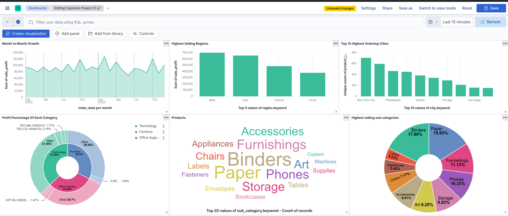

# ETL Pipeline Project

## Overview

This project implements an ETL (Extract, Transform, Load) pipeline using various technologies including Python, pandas, CSV files, Apache Airflow, Elasticsearch, Kibana, and pgAdmin4. The pipeline is designed to extract data from CSV files, transform it using pandas, load it into Elasticsearch, and visualize it using Kibana. PostgreSQL is used as a relational database management system, managed via pgAdmin4.

## Table of Contents

- [Overview](#overview)
- [Prerequisites](#prerequisites)
- [Installation](#installation)
- [Configuration](#configuration)
- [Usage](#usage)
- [ETL Pipeline](#etl-pipeline)
- [Visualization](#visualization)
- [Contributing](#contributing)
- [License](#license)


## Prerequisites

- Python 3.x
- Apache Airflow
- Elasticsearch
- Kibana
- PostgreSQL
- pgAdmin4
- Docker (optional, for containerized setup)

## Installation

1. **Clone the repository:**

    ```bash
    git clone https://github.com/yourusername/ETL-Pipeline-Project.git
    cd ETL-Pipeline-Project
    ```

2. **Create a virtual environment and activate it:**

    ```bash
    python -m venv venv
    source venv/bin/activate  # On Windows use `venv\Scripts\activate`
    ```

3. **Install the required Python packages:**

    ```bash
    pip install -r requirements.txt
    ```

4. **Install and configure Airflow:**

    Follow the [Airflow installation guide](https://airflow.apache.org/docs/apache-airflow/stable/installation.html).

5. **Set up Elasticsearch and Kibana:**

    Follow the [Elasticsearch installation guide](https://www.elastic.co/guide/en/elasticsearch/reference/current/install-elasticsearch.html) and the [Kibana installation guide](https://www.elastic.co/guide/en/kibana/current/install.html).

6. **Set up PostgreSQL and pgAdmin4:**

    Follow the [PostgreSQL installation guide](https://www.postgresql.org/download/) and the [pgAdmin4 installation guide](https://www.pgadmin.org/download/).

## Configuration

1. **Configure Airflow:**

    - Update the `airflow.cfg` file to set the necessary configurations.
    - Place your DAG file (`etl_dag.py`) in the `dags/` directory.

2. **Configure your database connections in `config/config.yaml`:**

    ```yaml
    postgresql:
      host: "localhost"
      database: "yourdatabase"
      user: "youruser"
      password: "yourpassword"

    elasticsearch:
      host: "localhost"
      port: 9200
    ```

## Usage

1. **Start Airflow:**

    ```bash
    airflow webserver --port 8080
    airflow scheduler
    ```

2. **Run the ETL pipeline:**

    Trigger the DAG via the Airflow UI.

3. **Access pgAdmin4:**

    Open pgAdmin4 and connect to your PostgreSQL instance.

4. **Access Kibana:**

    Open Kibana in your web browser to visualize the data.

## ETL Pipeline

- **Extract:**
  - Extract data from CSV files located in the `data/` directory using `extract.py`.

- **Transform:**
  - Transform the data using pandas.

- **Load:**
  - Load the transformed data into Elasticsearch.
  

## Visualization

Use Kibana to create visualizations and dashboards for your data stored in Elasticsearch.

## Contributing

1. Fork the repository.
2. Create a new branch: `git checkout -b feature-branch-name`
3. Make your changes and commit them: `git commit -m 'Add some feature'`
4. Push to the branch: `git push origin feature-branch-name`
5. Submit a pull request.


## License

This project is licensed under the MIT License - see the [LICENSE](LICENSE) file for details.
